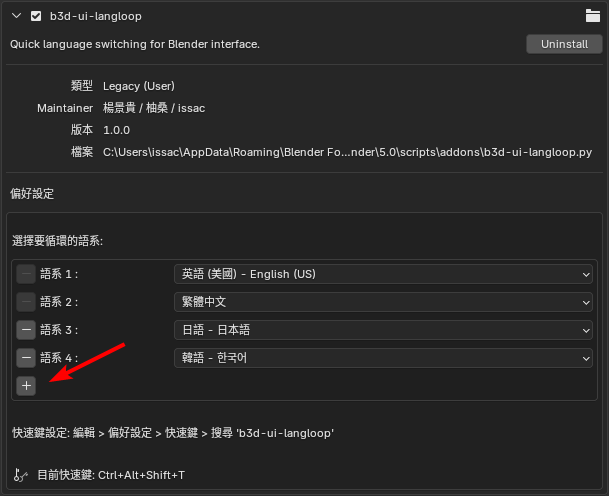

# b3d-ui-langloop User Manual

## 語言目錄 / Language Directory

| | | | |
| :--- | :--- | :--- | :--- |
| [1. 正體中文](#1-正體中文-traditional-chinese) | [8. Español](#8-español-spanish) | [15. Türkçe](#15-türkçe-turkish) | [22. Română](#22-română-romanian) |
| [2. 简体中文](#2-简体中文-simplified-chinese) | [9. Italiano](#9-italiano-italian) | [16. Tiếng Việt](#16-tiếng-việt-vietnamese) | [23. Dansk](#23-dansk-danish) |
| [3. English](#3-english-usuk) | [10. Português](#10-português-portuguese) | [17. ไทย](#17-ไทย-thai) | [24. Suomi](#24-suomi-finnish) |
| [4. 日本語](#4-日本語-japanese) | [11. Русский](#11-русский-russian) | [18. العربية](#18-العربية-arabic) | [25. Ελληνικά](#25-ελληνικά-greek) |
| [5. 한국어](#5-한국어-korean) | [12. Nederlands](#12-nederlands-dutch) | [19. Čeština](#19-čeština-czech) | |
| [6. Français](#6-français-french) | [13. Polski](#13-polski-polish) | [20. Magyar](#20-magyar-hungarian) | |
| [7. Deutsch](#7-deutsch-german) | [14. Svenska](#14-svenska-swedish) | [21. Bahasa Indonesia](#21-bahasa-indonesia-indonesian) | |

---

## 1. 正體中文 (Traditional Chinese)
### 目的
本外掛是專為非英語系使用者設計。在學習 Blender 時，經常會接觸到不同語系的教學，透過本外掛可以快速切換介面語言，大幅提升學習效率。
### 使用
- 僅需下載 `b3d-ui-langloop.py` 即可。
- 透過 Blender **編輯 > 偏好設定 > 附加元件 > 安裝...** ( [通用安裝教學](https://docs.blender.org/manual/en/latest/editors/preferences/addons.html) )。
- 安裝後，請使用 `Ctrl + Alt + Shift + T` 切換語系。
- 點擊 **"+"** 按鈕可以增加要切換的語系欄位。
- 循環語系欄位數量最多為 **10** 組。
### 設定
如果要修改快速鍵：
**編輯 > 偏好設定 > 快捷鍵 > 搜尋 'b3d-ui-langloop'**

[ 圖示 ](#b3d-ui-langloop-user-manual)

---

## 2. 简体中文 (Simplified Chinese)
### 目的
本插件专为非英语系用户设计。在学习 Blender 时，经常会接触到不同语系的教学，通过本插件可以快速切换界面语言，大幅提升学习效率。
### 使用
- 仅需下载 `b3d-ui-langloop.py` 即可。
- 通过 Blender **编辑 > 偏好设置 > 附加组件 > 安装...** ( [通用安装教学](https://docs.blender.org/manual/en/latest/editors/preferences/addons.html) )。
- 安装后，请使用 `Ctrl + Alt + Shift + T` 切换语系。
- 点击 **"+"** 按钮可以增加要切换的语系栏位。
- 循环语系栏位数量最多为 **10** 组。
### 设定
如果要修改快捷键：
**编辑 > 偏好设置 > 快捷键 > 搜索 'b3d-ui-langloop'**

[ 图示 ](#b3d-ui-langloop-user-manual)

---

## 3. English (US/UK)
### Purpose
This add-on is designed for non-English speakers. When learning Blender, users often encounter tutorials in various languages. This tool allows for rapid UI language switching to enhance learning efficiency.
### Usage
- Simply download `b3d-ui-langloop.py`.
- Go to **Edit > Preferences > Add-ons > Install...** ( [Official Installation Guide](https://docs.blender.org/manual/en/latest/editors/preferences/addons.html) ).
- Once installed, press `Ctrl + Alt + Shift + T` to switch languages.
- Click the **"+"** button to add more language slots to the cycle.
- Supports a maximum of **10** language slots.
### Settings
To modify the shortcut key:
**Edit > Preferences > Keymap > Search for 'b3d-ui-langloop'**

[ Image ](#b3d-ui-langloop-user-manual)

---

## 4. 日本語 (Japanese)
### 目的
このアドオンは、英語圏以外のユーザー向けに設計されています。Blenderを学習する際、多言語のチュートリアルを参照することが多いため、このアドオンを使用して言語を素早く切り替え、学習効率を高めることができます。
### 使用方法
- `b3d-ui-langloop.py` をダウンロードするだけです。
- Blenderの **編集 > プリファレンス > アドオン > インストール...** からインストールします。
- インストール後、`Ctrl + Alt + Shift + T` で言語を切り替えます。
- 画面上の **"+"** ボタンをクリックして、切り替える言語のスロットを追加できます。
- 最大 **10** 個の言語スロットを設定可能です。
### 設定
ショートカットキーを変更する場合：
**編集 > プリファレンス > キーマップ > 'b3d-ui-langloop' を検索**

[ 図解 ](#b3d-ui-langloop-user-manual)

---

## 5. 한국어 (Korean)
### 목적
이 애드온은 비영어권 사용자를 위해 설계되었습니다. Blender를 배울 때 다양한 언어의 튜토리얼을 접하게 되는데, 이 애드온을 통해 인터페이스 언어를 빠르게 전환하여 학습 효율을 높일 수 있습니다.
### 사용법
- `b3d-ui-langloop.py` 파일만 다운로드하면 됩니다.
- Blender **편집 > 환경설정 > 애드온 > 설치...** 를 통해 설치합니다.
- 설치 후, `Ctrl + Alt + Shift + T`를 사용하여 언어를 전환합니다.
- 인터페이스의 **"+"** 버튼을 클릭하여 전환할 언어 슬롯을 추가할 수 있습니다.
- 언어 순환 슬롯은 최대 **10**개까지 지원합니다.
### 설정
단축키를 수정하려면:
**편집 > 환경설정 > 키맵 > 'b3d-ui-langloop' 검색**

[ 도해 ](#b3d-ui-langloop-user-manual)

---

## 6. Français (French)
### Objectif
Cet add-on est conçu pour les utilisateurs non anglophones. Lors de l'apprentissage de Blender, il est courant de suivre des tutoriels dans d'autres langues. Cet outil permet de basculer rapidement la langue de l'interface.
### Utilisation
- Téléchargez simplement `b3d-ui-langloop.py`.
- Allez dans **Édition > Préférences > Add-ons > Installer...**
- Appuyez sur `Ctrl + Alt + Shift + T` pour changer de langue.
- Cliquez sur le bouton **"+"** pour ajouter des langues au cycle.
- Maximum **10** emplacements de langue.
### Réglages
Pour modifier le raccourci :
**Édition > Préférences > Raccourcis clavier > Rechercher 'b3d-ui-langloop'**

[ Illustration ](#b3d-ui-langloop-user-manual)

---

## 7. Deutsch (German)
### Zweck
Dieses Add-on ist für nicht-englischsprachige Benutzer gedacht. Beim Erlernen von Blender begegnet man oft Tutorials in anderen Sprachen. Dieses Tool ermöglicht einen schnellen Wechsel der UI-Sprache.
### Verwendung
- Laden Sie einfach `b3d-ui-langloop.py` herunter.
- Gehen Sie zu **Bearbeiten > Einstellungen > Add-ons > Installieren...**
- Drücken Sie `Strg + Alt + Umschalt + T`, um die Sprache zu wechseln.
- Klicken Sie auf **"+"**, um weitere Sprachen zum Zyklus hinzuzufügen.
- Maximal **10** Sprachslots möglich.
### Einstellungen
Tastenkürzel ändern:
**Bearbeiten > Einstellungen > Tastenbelegung > Suche nach 'b3d-ui-langloop'**

[ Abbildung ](#b3d-ui-langloop-user-manual)

---

## 8. Español (Spanish)
### Propósito
Este complemento está diseñado para usuarios que no hablan inglés. Al aprender Blender, es común encontrar tutoriales en otros idiomas. Esta herramienta permite cambiar rápidamente el idioma de la interfaz.
### Uso
- Descargue `b3d-ui-langloop.py`.
- Vaya a **Editar > Preferencias > Complementos > Instalar...**
- Use `Ctrl + Alt + Shift + T` para cambiar de idioma.
- Pulse el botón **"+"** para añadir más idiomas al ciclo.
- Máximo **10** espacios de idioma.
### Configuración
Modificar el atajo:
**Editar > Preferencias > Mapa de teclado > Buscar 'b3d-ui-langloop'**

[ Ilustración ](#b3d-ui-langloop-user-manual)

---

## 9. Italiano (Italian)
### Scopo
Questo add-on è pensato per utenti non anglofoni. Imparando Blender, si incontrano spesso tutorial in altre lingue. Questo strumento permette di cambiare rapidamente la lingua dell'interfaccia.
### Utilizzo
- Scarica `b3d-ui-langloop.py`.
- Vai su **Modifica > Preferenze > Add-on > Installa...**
- Premi `Ctrl + Alt + Shift + T` per cambiare lingua.
- Clicca sul pulsante **"+"** per aggiungere lingue al ciclo.
- Massimo **10** slot di lingua.
### Impostazioni
Cambiare la scorciatoia:
**Modifica > Preferenze > Mappa tasti > Cerca 'b3d-ui-langloop'**

[ Illustrazione ](#b3d-ui-langloop-user-manual)

---

## 10. Português (Portuguese)
### Objetivo
Este add-on foi criado para utilizadores que não falam inglês. Ao aprender Blender, é comum encontrar tutoriais noutros idiomas. Esta ferramenta permite alternar rapidamente o idioma da interface.
### Utilização
- Descarregue `b3d-ui-langloop.py`.
- Vá a **Editar > Preferências > Add-ons > Instalar...**
- Use `Ctrl + Alt + Shift + T` para alternar idiomas.
- Clique no botão **"+"** para adicionar mais idiomas ao ciclo.
- Suporta até **10** slots de idioma.
### Definições
Alterar o atalho:
**Editar > Preferências > Mapa de Teclado > Pesquisar 'b3d-ui-langloop'**

[ Ilustração ](#b3d-ui-langloop-user-manual)

---

## 11. Русский (Russian)
### Цель
Этот аддон предназначен для неанглоговорящих пользователей. При обучении Blender часто встречаются уроки на разных языках. Этот инструмент позволяет быстро переключать язык интерфейса.
### Использование
- Скачайте `b3d-ui-langloop.py`.
- Перейдите в **Правка > Настройки > Аддоны > Установить...**
- Нажмите `Ctrl + Alt + Shift + T` для переключения языка.
- Нажмите кнопку **"+"**, чтобы добавить языки в цикл.
- Максимум **10** языковых слотов.
### Настройки
Изменить горячую клавишу:
**Правка > Настройки > Карта клавиш > Поиск 'b3d-ui-langloop'**

[ Иллюстрация ](#b3d-ui-langloop-user-manual)

---

## 12. Nederlands (Dutch)
### Doel
Deze add-on is ontworpen voor niet-Engelstalige gebruikers. Bij het leren van Blender kom je vaak tutorials in andere talen tegen. Deze tool maakt het mogelijk om snel van taal te wisselen.
### Gebruik
- Download `b3d-ui-langloop.py`.
- Ga naar **Bewerken > Voorkeuren > Add-ons > Installeren...**
- Gebruik `Ctrl + Alt + Shift + T` om van taal te wisselen.
- Klik op de **"+"** knop om talen aan de cyclus toe te voegen.
- Maximaal **10** talen instelbaar.
### Instellingen
Sneltoets wijzigen:
**Bewerken > Voorkeuren > Keymap > Zoek naar 'b3d-ui-langloop'**

[ Illustratie ](#b3d-ui-langloop-user-manual)

---

## 13. Polski (Polish)
### Cel
Ten dodatek jest przeznaczony dla użytkowników nieanglojęzycznych. Podczas nauki Blendera często spotyka się poradniki w innych językach. To narzędzie pozwala na szybką zmianę języka interfejsu.
### Użycie
- Pobierz `b3d-ui-langloop.py`.
- Wejdź w **Edycja > Preferencje > Dodatki > Zainstaluj...**
- Użyj `Ctrl + Alt + Shift + T`, aby zmienić język.
- Kliknij przycisk **"+"**, aby dodać języki do cyklu.
- Maksymalnie **10** gniazd językowych.
### Ustawienia
Zmiana skrótu:
**Edycja > Preferencje > Mapowanie klawiszy > Szukaj 'b3d-ui-langloop'**

[ Ilustracja ](#b3d-ui-langloop-user-manual)

---

## 14. Svenska (Swedish)
### Syfte
Detta tillägg är för användare som inte har engelska som modersmål. Vid inlärning av Blender stöter man ofta på guider på andra språk. Detta verktyg gör det möjligt att snabbt byta språk.
### Användning
- Ladda ner `b3d-ui-langloop.py`.
- Gå till **Redigera > Inställningar > Tillägg > Installera...**
- Tryck `Ctrl + Alt + Shift + T` för att byta språk.
- Klicka på **"+"** för att lägga till fler språk i cykeln.
- Max **10** språkplatser.
### Inställningar
Ändra genväg:
**Redigera > Inställningar > Keymap > Sök efter 'b3d-ui-langloop'**

[ Illustration ](#b3d-ui-langloop-user-manual)

---

## 15. Türkçe (Turkish)
### Amaç
Bu eklenti İngilizce konuşmayan kullanıcılar için tasarlanmıştır. Blender öğrenirken sıkça farklı dillerdeki eğitimlerle karşılaşılır. Bu araç, arayüz dilini hızlıca değiştirmeyi sağlar.
### Kullanım
- `b3d-ui-langloop.py` dosyasını indirin.
- **Düzenle > Tercihler > Eklentiler > Kur...**
- Diller arasında geçiş yapmak için `Ctrl + Alt + Shift + T` tuşlarını kullanın.
- Döngüye dil eklemek için **"+"** düğmesine tıklayın.
- En fazla **10** dil yuvası desteklenir.
### Ayarlar
Kısayol tuşunu değiştirmek için:
**Düzenle > Tercihler > Tuş Haritası > 'b3d-ui-langloop' araması yapın**

[ Görsel ](#b3d-ui-langloop-user-manual)

---

## 16. Tiếng Việt (Vietnamese)
### Mục đích
Add-on này dành cho người dùng không sử dụng tiếng Anh. Khi học Blender, bạn thường gặp các bài hướng dẫn bằng ngôn ngữ khác. Công cụ này giúp chuyển đổi ngôn ngữ giao diện nhanh chóng.
### Sử dụng
- Tải xuống tệp `b3d-ui-langloop.py`.
- Vào **Chỉnh sửa > Tùy chọn > Add-on > Cài đặt...**
- Nhấn `Ctrl + Alt + Shift + T` để chuyển đổi ngôn ngữ.
- Nhấn nút **"+"** để thêm ngôn ngữ vào danh sách chờ.
- Hỗ trợ tối đa **10** ô ngôn ngữ.
### Cài đặt
Để thay đổi phím tắt:
**Chỉnh sửa > Tùy chọn > Sơ đồ phím > Tìm kiếm 'b3d-ui-langloop'**

[ Hình minh họa ](#b3d-ui-langloop-user-manual)

---

## 17. ไทย (Thai)
### วัตถุประสงค์
ส่วนเสริมนี้ออกแบบมาสำหรับผู้ที่ไม่ใช่เจ้าของภาษาอังกฤษ เมื่อเรียนรู้ Blender คุณมักจะพบกับบทเรียนในภาษาอื่นๆ เครื่องมือนี้ช่วยให้สลับภาษาของ UI ได้อย่างรวดเร็ว
### การใช้งาน
- ดาวน์โหลดไฟล์ `b3d-ui-langloop.py`
- ไปที่ **แก้ไข > การตั้งค่า > ส่วนเสริม > ติดตั้ง...**
- ใช้ `Ctrl + Alt + Shift + T` เพื่อสลับภาษา
- คลิกปุ่ม **"+"** เพื่อเพิ่มช่องภาษาที่ต้องการสลับ
- รองรับสูงสุด **10** ช่องภาษา
### การตั้งค่า
หากต้องการเปลี่ยนปุ่มลัด:
**แก้ไข > การตั้งค่า > ผังแป้นพิมพ์ > ค้นหา 'b3d-ui-langloop'**

[ แผนภาพ ](#b3d-ui-langloop-user-manual)

---

## 18. العربية (Arabic)
### الغرض
تم تصميم هذه الإضافة للمستخدمين غير الناطقين بالإنجليزية. عند تعلم Blender، غالباً ما تصادف دروساً بلغات أخرى. تتيح هذه الأداة تبديل لغة الواجهة بسرعة.
### الاستخدام
- قم بتنزيل ملف `b3d-ui-langloop.py`.
- انتقل إلى **تحرير > التفضيلات > الإضافات > تثبيت...**
- استخدم `Ctrl + Alt + Shift + T` لتبديل اللغة.
- انقر فوق الزر **"+"** لإضافة خانات لغات جديدة.
- يدعم ما يصل إلى **10** خانات لغات.
### الإعدادات
لتعديل مفتاح الاختصار:
**تحرير > التفضيلات > خريطة المفاتيح > ابحث عن 'b3d-ui-langloop'**

[ توضيح ](#b3d-ui-langloop-user-manual)

---

## 19. Čeština (Czech)
### Účel
Tento doplněk je určen pro neanglicky mluvící uživatele. Při studiu Blenderu se často setkáváte s návody v jiných jazycích. Tento nástroj umožňuje rychlé přepínání jazyka rozhraní.
### Použití
- Stáhněte si `b3d-ui-langloop.py`.
- Přejděte na **Upravit > Nastavení > Doplňky > Instalovat...**
- Stiskněte `Ctrl + Alt + Shift + T` pro přepnutí jazyka.
- Kliknutím na **"+"** přidáte další jazyky do seznamu.
- Max. **10** jazykových slotů.
### Nastavení
Změna klávesové zkratky:
**Upravit > Nastavení > Mapa kláves > Hledat 'b3d-ui-langloop'**

[ Ilustrace ](#b3d-ui-langloop-user-manual)

---

## 20. Magyar (Hungarian)
### Cél
Ez a kiegészítő nem angol nyelvű felhasználók számára készült. A Blender tanulása során gyakran találkozni más nyelvű oktatóanyagokkal. Ez az eszköz gyors nyelvváltást tesz lehetővé.
### Használat
- Töltse le a `b3d-ui-langloop.py` fájlt.
- **Szerkesztés > Beállítások > Kiegészítők > Telepítés...**
- Használja a `Ctrl + Alt + Shift + T` billentyűket a váltáshoz.
- Kattintson a **"+"** gombra további nyelvek hozzáadásához.
- Legfeljebb **10** nyelvi helyet támogat.
### Beállítások
Gyorsbillentyű módosítása:
**Szerkesztés > Beállítások > Billentyűkiosztás > Keresés: 'b3d-ui-langloop'**

[ Ábra ](#b3d-ui-langloop-user-manual)

---

## 21. Bahasa Indonesia (Indonesian)
### Tujuan
Add-on ini dirancang untuk pengguna non-Inggris. Saat belajar Blender, Anda sering menemui tutorial dalam bahasa lain. Alat ini memungkinkan perpindahan bahasa UI dengan cepat.
### Penggunaan
- Unduh `b3d-ui-langloop.py`.
- Buka **Edit > Preferensi > Add-on > Pasang...**
- Gunakan `Ctrl + Alt + Shift + T` untuk mengganti bahasa.
- Klik tombol **"+"** untuk menambah slot bahasa.
- Mendukung hingga **10** slot bahasa.
### Pengaturan
Untuk mengubah tombol pintas:
**Edit > Preferensi > Keymap > Cari 'b3d-ui-langloop'**

[ Ilustrasi ](#b3d-ui-langloop-user-manual)

---

## 22. Română (Romanian)
### Scop
Acest add-on este destinat utilizatorilor care nu vorbesc engleza. Când înveți Blender, întâlnești adesea tutoriale în alte limbi. Acest instrument permite schimbarea rapidă a limbii interfeței.
### Utilizare
- Descarcă `b3d-ui-langloop.py`.
- Mergi la **Editare > Preferințe > Add-on-uri > Instalare...**
- Folosește `Ctrl + Alt + Shift + T` pentru a schimba limba.
- Apasă butonul **"+"** pentru a adăuga limbi noi în ciclu.
- Suportă maximum **10** sloturi de limbă.
### Setări
Modificarea scurtăturii:
**Editare > Preferințe > Mapă taste > Căutare 'b3d-ui-langloop'**

[ Ilustrație ](#b3d-ui-langloop-user-manual)

---

## 23. Dansk (Danish)
### Formål
Denne add-on er designet til ikke-engelsktalende brugere. Når man lærer Blender, støder man ofte på vejledninger på andre sprog. Dette værktøj gør det muligt hurtigt at skifte sprog.
### Brug
- Download `b3d-ui-langloop.py`.
- Gå til **Rediger > Indstillinger > Add-ons > Installer...**
- Brug `Ctrl + Alt + Shift + T` for at skifte sprog.
- Klik på **"+"** knappen for at tilføje sprog til cyklussen.
- Maksimalt **10** sprogpladser.
### Indstillinger
Skift genvejstast:
**Rediger > Indstillinger > Keymap > Søg efter 'b3d-ui-langloop'**

[ Illustration ](#b3d-ui-langloop-user-manual)

---

## 24. Suomi (Finnish)
### Tarkoitus
Tämä lisäosa on tarkoitettu muille kuin englanninkielisille käyttäjille. Blenderiä opiskellessa törmää usein muunkielisiin ohjeisiin. Tämä työkalu mahdollistaa käyttöliittymän kielen nopean vaihdon.
### Käyttö
- Lataa `b3d-ui-langloop.py`.
- Mene **Muokkaa > Asetukset > Lisäosat > Asenna...**
- Käytä `Ctrl + Alt + Shift + T` vaihtaaksesi kieltä.
- Klikkaa **"+"**-painiketta lisätäksesi kieliä kiertoon.
- Enintään **10** kielipaikkaa.
### Asetukset
Pikanäppäimen muuttaminen:
**Muokkaa > Asetukset > Näppäinkartta > Etsi 'b3d-ui-langloop'**

[ Kuva ](#b3d-ui-langloop-user-manual)

---

## 25. Ελληνικά (Greek)
### Σκοπός
Αυτό το πρόσθετο έχει σχεδιαστεί για μη αγγλόφωνους χρήστες. Κατά την εκμάθηση του Blender, συχνά συναντάτε οδηγούς σε άλλες γλώσσες. Αυτό το εργαλείο επιτρέπει τη γρήγορη εναλλαγή της γλώσσας του περιβάλλοντος εργασίας.
### Χρήση
- Κατεβάστε το αρχείο `b3d-ui-langloop.py`.
- Μεταβείτε στο **Επεξεργασία > Προτιμήσεις > Πρόσθετα > Εγκατάσταση...**
- Χρησιμοποιήστε το `Ctrl + Alt + Shift + T` για εναλλαγή γλώσσας.
- Κάντε κλικ στο κουμπί **"+"** για να προσθέσετε γλώσσες στον κύκλο.
- Υποστηρίζονται έως και **10** θέσεις γλωσσών.
### Ρυθμίσεις
Για αλλαγή της συντόμευσης:
**Επεξεργασία > Προτιμήσεις > Χάρτης πλήκτρων > Αναζήτηση 'b3d-ui-langloop'**

[ Εικόνα ](#b3d-ui-langloop-user-manual)
